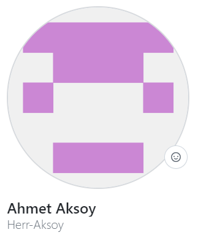
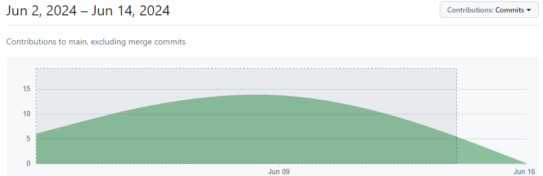

<p align="center"><strong>3D-Portfolio-Project</strong></p>
<p align="center">
    
</p>

<br><br>

## Project Owners
<table>
  <tr align="center" style="width: 67%;">
    <td></td>
    <td></td>
  </tr>
    <tr>
    <td><a href="" align="center">---------->Ahmet Aksoy<---------</a></td>
    <td><a href="" align="center">---------->Mehmet Sever<---------</a></td>
  </tr>
  <tr>
  <td align="center" style="width: 67%;">
    <a href="https://github.com/Herr-Aksoy">
      
    </a>
    <a href="https://www.linkedin.com/in/aksoy-ahmet/">
      
    </a>
    <a href="https://www.instagram.com/updated_devops?igsh=N3kxOWMwdDhsaTZl">
      
    </a>
    <a href="https://www.xing.com/profile/Ahmet_Aksoy68/web_profiles?expandNeffi=true">
      
    </a>
  </td>                                       <!--Mehmet Sever abi burdan asagi kisim senin-->
    <td align="center" style="width: 67%;">
    <a href="https://github.com/8mehmet11">
      
    </a>
    <a href="https://www.linkedin.com/in/mehmet8sever/">
      
    <!-- </a>
    <a href="https://www.instagram.com/updated_devops?igsh=N3kxOWMwdDhsaTZl">
      
    </a>
    <a href="https://www.xing.com/profile/Ahmet_Aksoy68/web_profiles?expandNeffi=true">
      
    </a> -->
</tr>
</table>
<br><br>
<!-- <table>
  <tr>
    <td colspan="3"></td>
  </tr>
  <tr>
    <td align="center"><a href="https://github.com/Herr-Aksoy/3D-Portfolio-Project/graphs/contributors" title="More information">Contributions to main, excluding merge commits</a></td>
  </tr>
</table> -->
  
<br><br>


You must add the **"const scriptURL ="** link in the Responsive-Website-Design.html file.

### Step 1: Creating a Blank Google Sheets
Go to Google Drive:

Go to Google Drive.
Create a New Google Sheets:

Click the "New" button in the upper left corner.
Select "Google Sheets" from the menu that opens and then click "Blank spreadsheet."
### Step 2: Accessing Apps Script
Open Google Sheets Document:

Open the Google Sheets document you just created.
Access Apps Script from Plugins Menu:

Click on the "Extensions" menu in the top menu.
Click "Apps Script" from the menu that opens.
### Step 3: Adding Apps Script Code
Add Code to Apps Script Editor:

The Apps Script editor will open in a new browser tab.
Paste the following code in the editor that opens and save it:


```sh

var sheetName = 'Sheet1'; // Type your tab name here, for example 'Data'
var scriptProp = PropertiesService.getScriptProperties();

function doPost(e) {
  var lock = LockService.getScriptLock();
  lock.waitLock(10000);

  try {
    var doc = SpreadsheetApp.openById(scriptProp.getProperty('key'));
    var sheet = doc.getSheetByName(sheetName);

    var newRow = sheet.getLastRow() + 1;
    var rowData = [];
    for (var param in e.parameter) {
      rowData.push(e.parameter[param]);
    }
    sheet.getRange(newRow, 1, 1, rowData.length).setValues([rowData]);

    sendEmail(rowData); // Yeni veri eklendiğinde mail gönder

    return ContentService
      .createTextOutput(JSON.stringify({'result': 'success', 'row': newRow}))
      .setMimeType(ContentService.MimeType.JSON);
  } catch (e) {
    return ContentService
      .createTextOutput(JSON.stringify({'result': 'error', 'error': e}))
      .setMimeType(ContentService.MimeType.JSON);
  } finally {
    lock.releaseLock();
  }
}

function setup() {
  var doc = SpreadsheetApp.getActiveSpreadsheet();
  scriptProp.setProperty('key', doc.getId());
}

function sendEmail(rowData) {
  // Alıcı mail adresi
  var recipient = "updateddevops@gmail.com"; // Write your own e-mail address here

  // Mail konusu ve içeriği
  var subject = "Responsive-Website-Design";
  var body = "Contact Me";

  // Verileri tablo formatında düzenleme
  var message = "";
  message += "<b>New Row Data:</b><br>";
  for (var i = 0; i < rowData.length; i++) {
    message += rowData[i] + "<br>";
  }

  // Mail gönderme işlemi
  MailApp.sendEmail({
    to: recipient,
    subject: subject,
    htmlBody: body + "<br><br>" + message
  });
}


```

### Step 4: Publishing the Script
Save and Publish Script:
Save your script and then run the setup function. To do this, select the setup function and click 
the run button from the menu. This will store the identity (ID) of your Google Sheets document.
Click the Deploy button from the top menu and select New deployment.
Select Web app from the Select type menu.
Select Me in Execute as and Anyone in Who has access.
Click the Deploy button and copy the resulting URL.

### Step 5: Adding the URL to Your HTML Form Code
Paste the URL into the Code:

Paste the URL you copied into the scriptURL variable in your HTML file:

```sh

const scriptURL = 'https://script.google.com/macros/s/your_script_id/exec'

```

